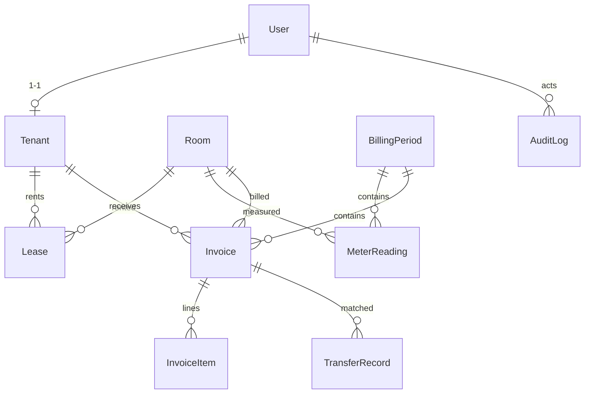

# Kiến trúc dự án — Chủ Trọ

Tài liệu giải thích **tại sao** dự án được tổ chức như vậy và **cách mở rộng** thêm tính năng một cách nhất quán.

---

## 1. Nguyên tắc thiết kế

1. **Một repo, hai vai trò**: Next.js App Router cho phép viết cả front-end (Server/Client Components) lẫn back-end (Route Handlers) trong cùng dự án — không cần tách 2 service riêng khi quy mô còn nhỏ, nhưng vẫn tách **lớp (layer)** rõ ràng để dễ scale.

2. **Phân tầng rõ ràng** (Separation of Concerns):

```
src/app/api/* (Route Handler)  →  chỉ parse request, validate, trả response
        │ gọi xuống
        ▼
src/lib/services/* (Service)   →  business logic, truy vấn DB
        │ dùng
        ▼
src/lib/db.ts (Prisma Client)  →  kết nối database
```

3. **DTO tách biệt với Model**: dữ liệu Prisma (Decimal, Date) được chuyển thành JSON thuần (number, ISO string) trước khi trả về client — nằm trong `lib/serializers.ts` và `types/index.ts`.

4. **Validate ở biên**: mọi input từ client đều qua **Zod** (`lib/validation`) trước khi vào service.

---

## 2. Giải thích từng phần

### `src/app/api` — Route Handlers (Back-end)

Mỗi thư mục là một endpoint, ví dụ:

- `api/rooms/route.ts` — `GET` (danh sách phòng).
- `api/rooms/[id]/route.ts` — `PATCH` (cập nhật phòng).
- `api/invoices/route.ts` — `GET` (danh sách hoá đơn).
- `api/invoices/generate/route.ts` — `POST` (sinh hoá đơn từ kỳ).
- `api/webhooks/sepay/route.ts` — `POST` (nhận giao dịch chuyển khoản từ SePay).

Các route cần database đều có `export const dynamic = "force-dynamic"` để **không bị prerender** ở build time.

**Response format chuẩn** (xem `lib/api/response.ts`):

```ts
ok(data)   → { success: true,  data }
fail(msg)  → { success: false, error: { message, details } }
```

Lỗi được gom vào `handleApiError` (`lib/api/error-handler.ts`): nhận diện lỗi Zod (422), lỗi Prisma P2002 (409 - trùng), P2025 (404 - không tìm thấy), cùng `DomainError` (HTTP code tuỳ ý) từ `lib/api/errors.ts`.

### `src/lib/services` — Service layer

Chứa logic nghiệp vụ. Route handler **không** chứa SQL/query trực tiếp. Các service hiện có:

| Service | Trách nhiệm |
|---|---|
| `auth.service.ts` | Đăng nhập, đổi mật khẩu, quản lý phiên |
| `tenant.service.ts` | CRUD người thuê, tài khoản, reset mật khẩu |
| `room.service.ts` | Quản lý phòng |
| `lease.service.ts` | Hợp đồng thuê, kết thúc hợp đồng |
| `billing.service.ts` | Kỳ thanh toán, hoá đơn, đối soát chuyển khoản |
| `dashboard.service.ts` | Số liệu tổng quan |
| `bank.service.ts` | Tài khoản ngân hàng nhận tiền |
| `sepay.service.ts` | Xác minh & xử lý webhook SePay |
| `audit.service.ts` | Ghi nhật ký hành động |

Lợi ích của tầng này: dễ viết unit test (không cần mock HTTP), có thể gọi lại từ Server Component mà không cần qua HTTP, logic tập trung tránh trùng lặp.

### `src/lib/db.ts` — Prisma singleton

```ts
export const db = globalForPrisma.prisma ?? createPrismaClient();
```

Dùng `globalThis` để tái sử dụng connection pool giữa các lần hot-reload (tránh `Too many connections`), đặc biệt quan trọng trên **Vercel serverless**.

> ⚠️ **Prisma 7 lưu ý quan trọng**:
> - Generator mới là `prisma-client` (sinh code vào `src/generated/prisma`, **gitignored**).
> - Bắt buộc dùng **driver adapter**: `new PrismaClient({ adapter: new PrismaPg(...) })` (`@prisma/adapter-pg`).
> - `postinstall: prisma generate` tự sinh lại client sau `npm install` (cả trên Vercel).
> - `prisma.config.ts` load `.env` qua `dotenv/config`.
> - `DATABASE_URL` dùng cho runtime (qua pooler/pgBouncer), `DIRECT_URL` dùng cho migration.

### Auth — `src/lib/auth` + `src/proxy.ts`

- **Custom auth, KHÔNG dùng Auth.js/NextAuth**: JWT ký bằng **jose** (`lib/auth/jwt.ts`), lưu trong **httpOnly cookie** `session` (7 ngày). Payload tối thiểu: `sub` (userId), `role`, `name`.
- `bcryptjs` để băm mật khẩu (`lib/auth/password.ts`).
- **Route guard**: Next.js 16 thay `middleware.ts` bằng **`src/proxy.ts`** (export `proxy` + `config.matcher`). Proxy chỉ parse JWT (Edge-safe, **không gọi DB**):
  - `/dashboard/*` → chỉ `ADMIN`.
  - `/app/*` → chỉ `TENANT`.
  - `/login` → chuyển hướng theo vai trò nếu đã đăng nhập.
- **`getCurrentUser`** (`lib/auth/current-user.ts`) tra DB mỗi request — chặn tài khoản bị khoá (`isActive=false`) hoặc đã xoá ngay cả khi JWT còn hạn.

### `src/components` — UI

- `ui/` — component tái sử dụng **không chứa logic nghiệp vụ** (Button, Card, Badge, Input, CopyButton).
- `dashboard/` — khung giao diện dashboard (Sidebar dùng `"use client"` để biết route đang active).
- `admin/` — component gắn logic nghiệp vụ: quản lý phòng, người thuê, hoá đơn, giao dịch.
- `tenant/` — giao diện người thuê: thẻ hoá đơn, mã QR thanh toán, bottom nav.
- `auth/` — form đăng nhập, đổi mật khẩu.

### Server Components vs Client Components

- Mặc định là **Server Component** (trang, layout, header...) → render ở server, SEO tốt.
- Chỉ thêm `"use client"` khi cần tương tác: `Sidebar`, các form, các bảng quản lý.

---

## 3. Cách thêm một tính năng mới (pattern chuẩn)

Ví dụ thêm module **Thiết bị nội thất (Asset)**:

1. **Schema**: thêm/điều chỉnh model trong `prisma/schema.prisma` → `npm run db:push` (hoặc tạo migration).
2. **Validation**: tạo `src/lib/validation/asset.ts` (Zod schema).
3. **Service**: tạo `src/lib/services/asset.service.ts` (hàm CRUD).
4. **API**: tạo `src/app/api/assets/route.ts` và `src/app/api/assets/[id]/route.ts`.
5. **Types + Serializer**: thêm DTO vào `src/types/index.ts`, hàm serialize nếu cần.
6. **UI**: tạo trang `src/app/dashboard/assets/page.tsx` + component trong `src/components/admin/`.
7. **Menu**: thêm mục vào `navItems` trong `src/config/site.ts`.

---

## 4. Mô hình dữ liệu (Prisma)



| Model | Ý nghĩa |
|---|---|
| `User` | Tài khoản đăng nhập (`ADMIN`/`TENANT`) |
| `Tenant` | Hồ sơ người thuê (gắn 1-1 với `User`) |
| `Room` | Phòng trọ (số phòng, tầng, giá cơ bản, trạng thái) |
| `Lease` | Hợp đồng thuê (ai thuê phòng nào, từ khi nào, tiền cọc) |
| `BillingPeriod` | Kỳ thanh toán theo tháng (mã `YYYY-MM`) |
| `MeterReading` | Chỉ số điện/nước theo phòng trong một kỳ |
| `Invoice` | Hoá đơn tiền phòng (mỗi phòng mỗi kỳ một hoá đơn) |
| `InvoiceItem` | Chi tiết từng khoản phí (RENT, ELECTRICITY, WATER...) |
| `BankAccount` | Tài khoản ngân hàng nhận tiền (dùng cho VietQR) |
| `TransferRecord` | Bản ghi giao dịch chuyển khoản (webhook / nhập tay) |
| `AuditLog` | Nhật ký hành động |
| `Setting` | Cài đặt hệ thống (đơn giá, ngày hạn mặc định) |

Enums: `UserRole`, `RoomStatus`, `LeaseStatus`, `BillingPeriodStatus`, `InvoiceStatus`, `FeeType`, `TransferStatus`, `TransferSource`.

---

## 5. Môi trường & bảo mật

- `.env` (thật) bị **gitignore**; chỉ commit `.env.example`.
- `DATABASE_URL`, `DIRECT_URL`, `AUTH_SECRET`, `SEPA_WEBHOOK_SECRET` chỉ dùng ở server — **không** lộ ra client. Biến public phải có tiền tố `NEXT_PUBLIC_`.
- Đăng nhập chống timing user-enumeration (dùng `DUMMY_PASSWORD_HASH` trong `lib/auth/password.ts`).
- Webhook SePay xác minh chữ ký `HMAC-SHA256` (`X-Signature`) hoặc `Authorization: Apikey`, và khớp nội dung chuyển khoản với mã hoá đơn (`invoice.code`).
- Lỗ hổng `deepmerge-ts` (báo trong `npm audit`) nằm trong `@prisma/config` — chỉ dùng bởi **Prisma CLI** ở build-time, **không** nằm trong bundle chạy production nên an toàn để yên (bản vá yêu cầu hạ cấp Prisma, không nên làm).

---

## 6. CI/CD trên Vercel

```
Git push → Vercel nhận webhook → npm install (postinstall: prisma generate)
        → next build → deploy
```

Schema DB hiện đang dùng `db:push` (chưa có thư mục `prisma/migrations`). Khi chuyển sang migration chính thức, trước khi deploy cần chạy `prisma migrate deploy` — có thể thêm vào script build hoặc chạy thủ công qua Vercel CLI.
